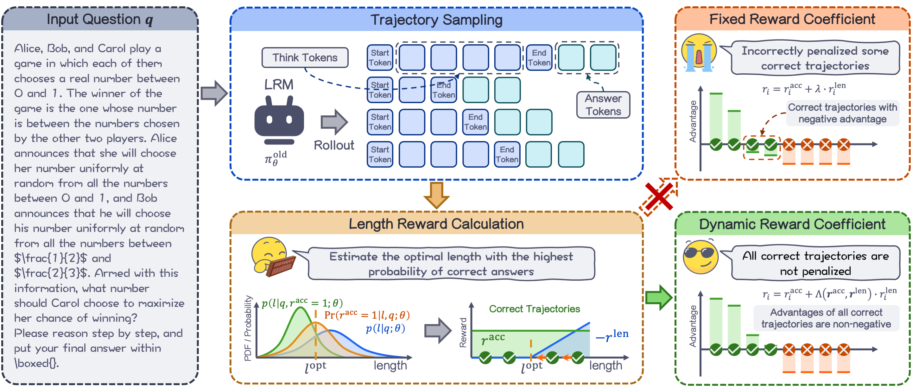

<h1 align="center">
SmartThinker: Progressive Chain-of-Thought Length Calibration for Efficient Large Language Model Reasoning
</h1>

<div align="center">

[](https://huggingface.co/collections/etherwindy/smartthinker) [](https://arxiv.org/abs/2603.08000)

</div>



Large reasoning models (LRMs) like OpenAI o1 and DeepSeek-R1 achieve high accuracy on complex tasks by adopting long chain-of-thought (CoT) reasoning paths. However, the inherent verbosity of these processes frequently results in redundancy and overthinking. To address this issue, existing works leverage Group Relative Policy Optimization (GRPO) to reduce LRM output length, but their static length-reward designs fail to adapt to problem difficulty and response-length distributions, causing over-compression and compromised accuracy. Therefore, we propose *SmartThinker*, a novel GRPO-based efficient reasoning method with progressive CoT length calibration. *SmartThinker* makes a two-fold contribution: First, it dynamically estimates the optimal length with peak accuracy during training and guides overlong responses toward it to reduce reasoning length while sustaining accuracy. Second, it dynamically modulates the length-reward coefficient to avoid the unwarranted penalization of correct reasoning paths. Extensive experimental results show that *SmartThinker* achieves up to 52.6% length compression with improved accuracy and achieves up to 16.6% accuracy relative improvement on challenging benchmarks like AIME25. The source code can be found at https://github.com/SJTU-RTEAS/SmartThinker.

## 📢 News

- 🔥 [2026-05-31] We have updated the camera-ready version on arXiv!
- ‼️ [2026-04-30] We are pleased to announce that our paper has been accepted by ICML 2026! 🎉🎊🥳ֱ👏
- 🔥 [2026-03-09] The paper can be accessed on arXiv now!🌟
- 🔥 [2026-02-12] We have open-sourced the training and testing scripts from the paper, as well as all 1.5B and 4B parameter models!🤗

## 📦 Resources

- 📄 Paper: [SmartThinker: Progressive Chain-of-Thought Length Calibration for Efficient Large Language Model Reasoning](https://github.com/SJTU-RTEAS/SmartThinker)
- 💻 Code: [github]()
- 🧠 Models: [huggingface](https://huggingface.co/collections/etherwindy/smartthinker)

## 🚀 Quick Start

### Dependencies

- python: 3.12
- verl: 0.7.0.dev0
- CUDA: 12.8
- pytorch: 2.8.0
- vllm: 0.11.0

### Setup

Clone the repository:

``` bash
git clone https://github.com/SJTU-RTEAS/SmartThinker.git
cd SmartThinker
```

Install dependencies:

``` bash
conda create -n SmartThinker python==3.12
conda activate SmartThinker
pip install -r requirement.txt
```

### Data Preprocess

Training dataset:

``` bash
python data_preprocess/deepscaler.py
```

Test dataset:

``` bash
python data_preprocess/aime25.py
```

### Training

First you need to configure your wandb api key:

``` bash
export WANDB_API_KEY="YOUR_WANDB_API_KEY"
```

You can also configure it in the `.env` file at the root directory of the repository:

``` bash
WANDB_API_KEY="YOUR_WANDB_API_KEY"
```

The training scripts are located in the `script` folder. Take 1.5B model as an example, run the following command to start training:

``` bash
bash scripts/SmartThinker_Distill_1.5B.sh --model "YOUR_MODEL_PATH"
```

After training is complete, run the following command to convert the specified checkpoint to the Hugging Face model format：

``` bash
bash scripts/fsdp_merge_Distill_1.5B.sh
```

### Test

The test scripts are located in the `src/test` folder. Take AIME25 as an example, run the following command to test the finetuned model:

``` bash
python src/test/aime25_vllm.py --model_path "YOUR_MODEL_PATH"
```

## 🔗 Citation

``` bibtex
@article{hu2026smartthinker,
  title={SmartThinker: Progressive Chain-of-Thought Length Calibration for Efficient Large Language Model Reasoning},
  author={Hu, Chenzhi and Hu, Qinzhe and Xu, Yuhang and Chen, Junyi and Wang, Ruijie and Liu, Shengzhong and Li, Jianxin and Wu, Fan and Chen, Guihai},
  journal={arXiv preprint arXiv:2603.08000},
  year={2026}
}
```